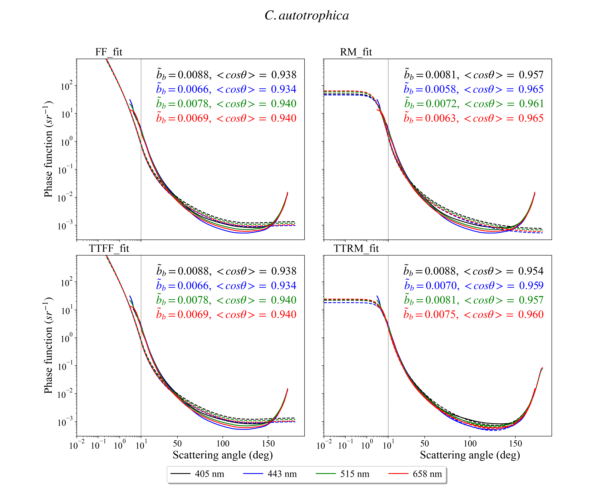

# PFfit

Package `pffit` provides simple tools to fit scattering 
phase functions based on diverse single and two-term empirical models.


### Installing

To install the package:
```
python setup.py install
```

or 

```
python setup.py install --user
```

## Examples
To apply the fitting modalities onto provided data (pffit/data) and generate the associated figures (in pffit/fig)

```
python pffit/paper_fig.py
```
You should get this type of figures in pffit/fig




## Contributing

Please contact [authors](tristan.harmel@gmail.com) for details on our code of conduct, and the process for submitting pull requests to us.

## Authors

* **Tristan Harmel** - *Initial work* - [contact](tristan.harmel@gmail.com)

See also the list of [contributors](...) who participated in this project.

## License

This project is licensed under the MIT License - see the [LICENSE.md](LICENSE.md) file for details

 
## Warning: 


